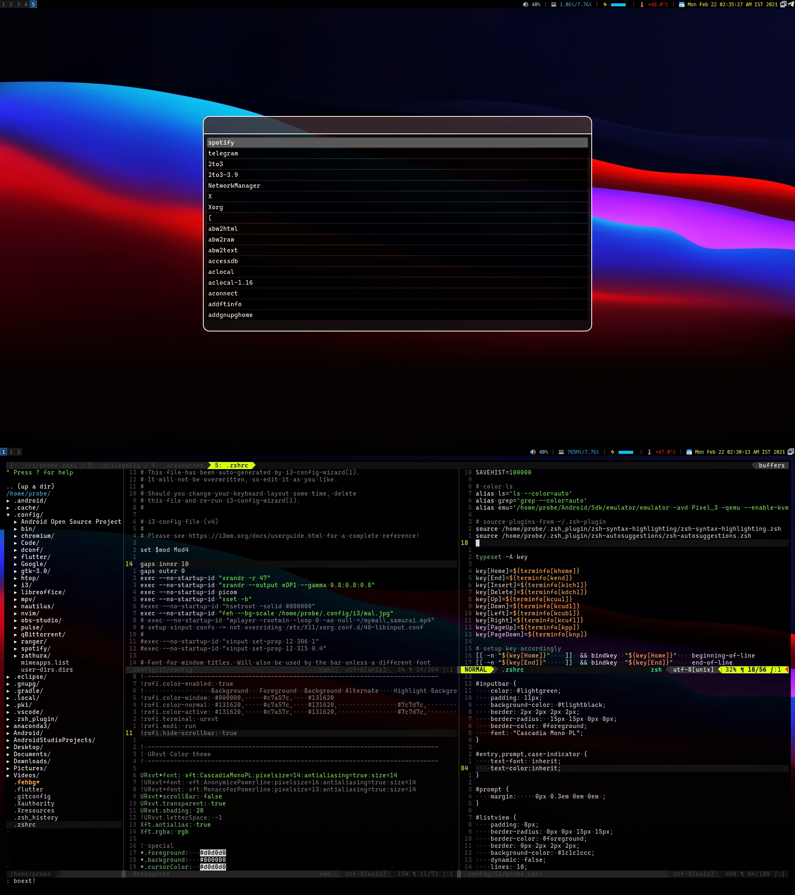

# i3Confs

Houses a heavy configuration for a nice i3-gaps rice

## Requirements

Basic system tools with build-utils and other fancies

## Images

## Installation

Well - if you're running a proper linux system (arch here) with a keen eye on ricing and familiarity with windows managers, you already know how to...

## Issues

None encountered so far - feel free to PR with modifications/tag issues if you encounter any
